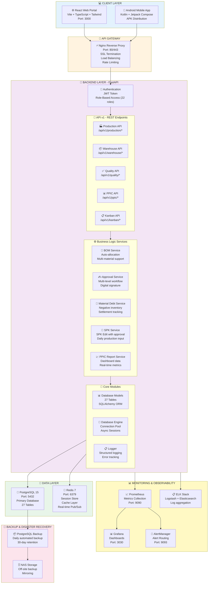
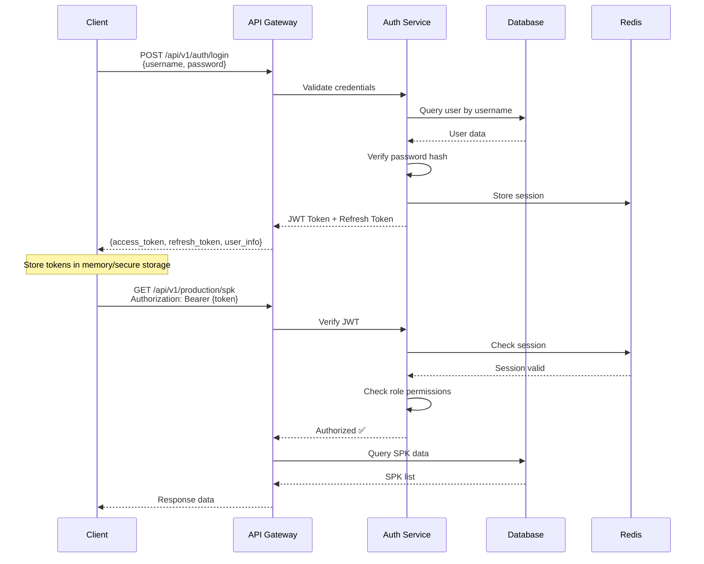
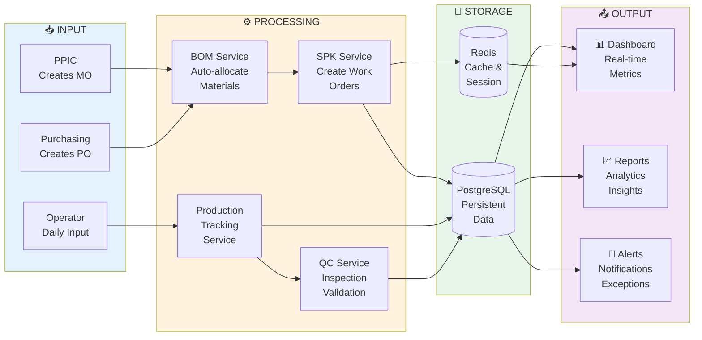

# 🏗️ SYSTEM ARCHITECTURE DIAGRAM
**ERP Quty Karunia - Complete System Architecture**  
**Generated**: 2 Februari 2026  
**Architecture Type**: Modular Monolith with Microservices-ready Structure

---

## 🎯 HIGH-LEVEL ARCHITECTURE



---

## 🏛️ DETAILED ARCHITECTURE LAYERS

### 1️⃣ CLIENT LAYER

#### 🌐 Web Portal (React + Vite)
```
erp-ui/frontend/
├── src/
│   ├── components/          # Reusable UI components
│   │   ├── Dashboard/      # Main dashboard
│   │   ├── Production/     # Production screens
│   │   ├── Warehouse/      # Warehouse screens
│   │   ├── QC/            # Quality control
│   │   └── PPIC/          # Planning screens
│   ├── pages/              # Route pages
│   ├── services/           # API client services
│   ├── stores/             # State management (Zustand)
│   ├── hooks/              # Custom React hooks
│   └── utils/              # Utilities
├── vite.config.ts          # Vite configuration
├── tailwind.config.js      # Tailwind CSS
└── package.json

Tech Stack:
- React 18
- TypeScript 5
- Vite (Build tool)
- Tailwind CSS (Styling)
- Zustand (State management)
- React Query (API calls)
- React Router (Navigation)
```

#### 📱 Mobile App (Android Native)
```
erp-ui/mobile/
├── app/src/main/
│   ├── java/com/qutykarunia/erp/
│   │   ├── ui/
│   │   │   ├── production/    # Production screens
│   │   │   ├── warehouse/     # Warehouse screens
│   │   │   ├── qc/           # QC screens
│   │   │   └── finishgood/   # FG screens (optimized)
│   │   ├── data/
│   │   │   ├── api/          # Retrofit API clients
│   │   │   ├── repository/   # Data repositories
│   │   │   └── models/       # Data models
│   │   ├── viewmodel/        # ViewModels (MVVM)
│   │   └── utils/            # Utilities
│   └── res/                  # Resources
├── build.gradle.kts
└── settings.gradle.kts

Tech Stack:
- Kotlin
- Jetpack Compose (Modern UI)
- Retrofit (HTTP client)
- Room (Local DB cache)
- Coroutines (Async)
- Navigation Component
- Material Design 3
```

---

### 2️⃣ API GATEWAY LAYER

#### ⚡ Nginx Configuration
```nginx
# nginx.conf
server {
    listen 80;
    listen 443 ssl http2;
    server_name erp.qutykarunia.local;
    
    # SSL Configuration
    ssl_certificate /etc/nginx/ssl/cert.pem;
    ssl_certificate_key /etc/nginx/ssl/key.pem;
    
    # Security Headers
    add_header X-Frame-Options "SAMEORIGIN" always;
    add_header X-Content-Type-Options "nosniff" always;
    add_header X-XSS-Protection "1; mode=block" always;
    
    # Rate Limiting (100 req/min per IP)
    limit_req_zone $binary_remote_addr zone=api_limit:10m rate=100r/m;
    limit_req zone=api_limit burst=20 nodelay;
    
    # Backend Proxy
    location /api/ {
        proxy_pass http://backend:8000;
        proxy_set_header Host $host;
        proxy_set_header X-Real-IP $remote_addr;
        proxy_set_header X-Forwarded-For $proxy_add_x_forwarded_for;
        proxy_set_header X-Forwarded-Proto $scheme;
        
        # Timeouts
        proxy_connect_timeout 60s;
        proxy_send_timeout 60s;
        proxy_read_timeout 60s;
    }
    
    # Frontend (React)
    location / {
        proxy_pass http://frontend:3000;
    }
    
    # WebSocket support (for real-time features)
    location /ws/ {
        proxy_pass http://backend:8000;
        proxy_http_version 1.1;
        proxy_set_header Upgrade $http_upgrade;
        proxy_set_header Connection "upgrade";
    }
}

Features:
✅ SSL/TLS termination
✅ Load balancing ready
✅ Rate limiting (DDoS protection)
✅ Security headers
✅ WebSocket support
✅ Request logging
```

---

### 3️⃣ BACKEND LAYER (FastAPI)

#### 🗂️ Project Structure
```
erp-softtoys/
├── app/
│   ├── main.py                      # Application entry point
│   │
│   ├── core/                        # Core infrastructure
│   │   ├── __init__.py
│   │   ├── database.py              # SQLAlchemy engine, session
│   │   ├── auth.py                  # JWT authentication
│   │   ├── logger.py                # Structured logging
│   │   ├── config.py                # Configuration management
│   │   └── models/                  # Database ORM models (27 tables)
│   │       ├── __init__.py
│   │       ├── manufacturing.py     # MO, SPK, WorkOrder
│   │       ├── products.py          # Product, Category, Partner
│   │       ├── warehouse.py         # Stock, Location, PO
│   │       ├── bom.py              # BOM Header/Detail/Variant
│   │       ├── sales.py            # Sales Order
│   │       ├── users.py            # User with 22 roles
│   │       ├── quality.py          # QC Tests, Inspections
│   │       ├── daily_production.py  # SPK Daily, Material Debt
│   │       ├── production.py       # SPK Material Allocation
│   │       ├── kanban.py           # Kanban boards
│   │       ├── audit.py            # Audit logs
│   │       ├── transfer.py         # Transfer logs
│   │       └── exceptions.py       # Alert logs
│   │
│   ├── api/                         # API endpoints
│   │   ├── __init__.py
│   │   ├── approvals.py            # Approval endpoints
│   │   └── v1/                     # API version 1
│   │       ├── __init__.py
│   │       ├── production/         # Production module APIs
│   │       │   ├── bom.py         # BOM auto-allocation
│   │       │   ├── spk.py         # SPK CRUD + edit
│   │       │   ├── daily.py       # Daily production input
│   │       │   └── reports.py     # Production reports
│   │       ├── warehouse/          # Warehouse APIs
│   │       │   ├── stock.py       # Stock management
│   │       │   ├── transfer.py    # Inter-dept transfer
│   │       │   └── po.py          # Purchase orders
│   │       ├── quality/            # QC APIs
│   │       │   ├── inspection.py  # Inline inspection
│   │       │   ├── lab.py         # Lab tests
│   │       │   └── segregation.py # Segregation handling
│   │       ├── ppic/              # PPIC APIs
│   │       │   ├── dashboard.py   # Real-time dashboard
│   │       │   ├── mo.py          # MO management
│   │       │   └── reports.py     # PPIC reports
│   │       └── kanban/            # Kanban APIs
│   │           └── board.py       # Board management
│   │
│   ├── services/                   # Business logic layer
│   │   ├── __init__.py
│   │   ├── bom_service.py         # BOM auto-allocation logic
│   │   ├── approval_service.py     # Multi-level approval
│   │   ├── material_debt_service.py # Negative inventory
│   │   ├── spk_edit_service.py    # SPK edit with approval
│   │   └── ppic_report_service.py  # Dashboard metrics
│   │
│   ├── modules/                    # Feature modules
│   │   ├── production/
│   │   ├── warehouse/
│   │   ├── quality/
│   │   └── approval/
│   │
│   └── shared/                     # Shared utilities
│       ├── schemas.py             # Pydantic models
│       ├── utils.py               # Helper functions
│       └── constants.py           # Constants
│
├── alembic/                        # Database migrations
│   ├── versions/
│   │   ├── 001_add_spk_material_allocation.py
│   │   ├── 002_add_approval_workflow.py
│   │   └── ...
│   └── env.py
│
├── tests/                          # Unit & integration tests
│   ├── conftest.py
│   ├── test_bom_service.py
│   ├── test_approval_workflow.py
│   └── ...
│
├── Dockerfile                      # Multi-stage Docker build
├── requirements.txt                # Production dependencies
├── requirements-dev.txt            # Development dependencies
├── pyproject.toml                  # Project metadata
├── pytest.ini                      # Pytest configuration
└── alembic.ini                     # Alembic configuration
```

#### 🔧 Tech Stack
```python
# Backend Technologies
FastAPI 0.109+          # Modern async web framework
SQLAlchemy 2.0+         # ORM for database
Alembic 1.13+           # Database migrations
Pydantic 2.5+           # Data validation
PostgreSQL 15           # Primary database
Redis 7                 # Caching & sessions
PyJWT 2.8+              # JWT authentication
Uvicorn 0.27+           # ASGI server
Pytest 7.4+             # Testing framework
```

#### 🔐 Authentication Flow


#### 🚀 API Endpoints Overview
```
📡 API v1 Endpoints (Total: ~150 endpoints)

🏭 Production Module (/api/v1/production)
├── POST   /bom/create-with-auto-allocation    # Auto-allocate materials
├── GET    /bom/allocation-preview/{id}        # Preview allocation
├── POST   /spk/create                         # Create SPK
├── PUT    /spk/{id}/edit                      # Edit SPK (with approval)
├── POST   /spk/{id}/daily-input               # Daily production input
├── GET    /spk/{id}/progress                  # Progress tracking
├── POST   /spk/{id}/complete                  # Complete SPK
└── GET    /reports/production-summary         # Production reports

📦 Warehouse Module (/api/v1/warehouse)
├── GET    /stock/summary                      # Stock levels
├── POST   /stock/move                         # Stock movement
├── POST   /transfer/inter-dept                # Transfer between depts
├── GET    /stock/lot/{id}                     # Lot tracking
├── POST   /po/create                          # Create PO
├── PUT    /po/{id}/receive                    # Receive goods
└── GET    /reports/inventory                  # Inventory reports

✅ Quality Module (/api/v1/quality)
├── POST   /inspection/inline                  # Inline inspection
├── POST   /inspection/final                   # Final inspection
├── POST   /lab/test                          # Lab test
├── GET    /lab/results/{batch}               # Test results
├── POST   /segregation/create                # Create segregation
└── GET    /reports/defect-analysis           # Defect reports

📊 PPIC Module (/api/v1/ppic)
├── GET    /dashboard/real-time               # Real-time dashboard
├── POST   /mo/create                         # Create MO
├── PUT    /mo/{id}/release                   # Release MO
├── GET    /mo/{id}/progress                  # MO progress
├── GET    /reports/weekly-production         # Weekly reports
└── GET    /reports/material-requirements     # MRP reports

📋 Kanban Module (/api/v1/kanban)
├── GET    /boards                            # List boards
├── POST   /cards/create                      # Create card
├── PUT    /cards/{id}/move                   # Move card
└── GET    /cards/{id}                        # Card details

✍️ Approval Module (/api/v1/approvals)
├── GET    /pending                           # Pending approvals
├── POST   /{id}/approve                      # Approve request
├── POST   /{id}/reject                       # Reject request
└── GET    /{id}/history                      # Approval history
```

---

### 4️⃣ DATA LAYER

#### 🐘 PostgreSQL 15 Configuration
```sql
-- Database: erp_quty_karunia
-- Tables: 27 tables
-- Estimated Size: ~10 GB/year
-- Connections: 100 max

-- Performance Tuning
shared_buffers = 4GB                    -- 25% of RAM
effective_cache_size = 12GB             -- 75% of RAM
maintenance_work_mem = 1GB
checkpoint_completion_target = 0.9
wal_buffers = 16MB
default_statistics_target = 100
random_page_cost = 1.1                  -- For SSD
effective_io_concurrency = 200

-- Connection Pooling (PgBouncer)
max_client_conn = 100
default_pool_size = 20
reserve_pool_size = 5
```

#### 🔴 Redis 7 Configuration
```
# redis.conf
maxmemory 2gb
maxmemory-policy allkeys-lru

# Persistence
save 900 1          # Save if 1 key changed in 15 min
save 300 10         # Save if 10 keys changed in 5 min
save 60 10000       # Save if 10k keys changed in 1 min

# Use Cases:
# 1. Session Storage (JWT tokens)
# 2. Cache Layer (frequently accessed data)
# 3. Real-time Pub/Sub (dashboard updates)
# 4. Rate Limiting (API throttling)
```

---

### 5️⃣ MONITORING & OBSERVABILITY

#### 📈 Prometheus Metrics
```yaml
# prometheus.yml
global:
  scrape_interval: 15s
  evaluation_interval: 15s

scrape_configs:
  - job_name: 'erp-backend'
    static_configs:
      - targets: ['backend:8000']
    
  - job_name: 'postgres'
    static_configs:
      - targets: ['postgres-exporter:9187']
    
  - job_name: 'redis'
    static_configs:
      - targets: ['redis-exporter:9121']

# Metrics Collected:
- Request count
- Response time (p50, p95, p99)
- Error rate
- Database query time
- Connection pool usage
- Redis cache hit rate
```

#### 📊 Grafana Dashboards
```
Dashboard 1: API Performance
├── Request Rate (req/s)
├── Response Time (ms)
├── Error Rate (%)
└── Top 10 Slow Endpoints

Dashboard 2: Database Performance
├── Query Execution Time
├── Connection Pool Usage
├── Table Size Growth
└── Lock Wait Time

Dashboard 3: Business Metrics
├── Daily Production Output
├── Material Consumption
├── QC Pass Rate
└── Warehouse Stock Levels

Dashboard 4: System Health
├── CPU Usage
├── Memory Usage
├── Disk I/O
└── Network Traffic
```

---

## 🔄 DATA FLOW DIAGRAM



---

## 🛡️ SECURITY ARCHITECTURE

### Defense in Depth Strategy

```mermaid
flowchart TB
    subgraph PERIMETER["🛡️ PERIMETER SECURITY"]
        FIREWALL["Firewall<br/>Port filtering<br/>IP whitelist"]
        WAF["Web Application Firewall<br/>SQL injection protection<br/>XSS filtering"]
    end
    
    subgraph NETWORK["🌐 NETWORK SECURITY"]
        SSL["SSL/TLS 1.3<br/>Certificate pinning"]
        NGINX_SEC["Nginx Security<br/>Rate limiting<br/>DDoS protection"]
    end
    
    subgraph APP["🔐 APPLICATION SECURITY"]
        AUTH_LAYER["JWT Authentication<br/>Token expiration<br/>Refresh token rotation"]
        RBAC["Role-Based Access Control<br/>22 roles<br/>Permission matrix"]
        INPUT_VAL["Input Validation<br/>Pydantic schemas<br/>SQL injection prevention"]
        CSRF["CSRF Protection<br/>Token validation"]
    end
    
    subgraph DATA_SEC["💾 DATA SECURITY"]
        ENCRYPT["Encryption at Rest<br/>Password hashing (bcrypt)<br/>Sensitive data encryption"]
        BACKUP["Encrypted Backups<br/>Off-site storage<br/>30-day retention"]
        AUDIT["Audit Trail<br/>All actions logged<br/>Tamper-proof"]
    end
    
    subgraph MONITORING_SEC["👁️ SECURITY MONITORING"]
        SIEM["Security Logs<br/>Failed login attempts<br/>Unauthorized access"]
        ALERT_SEC["Real-time Alerts<br/>Suspicious activities<br/>Security events"]
    end
    
    FIREWALL --> WAF
    WAF --> SSL
    SSL --> NGINX_SEC
    NGINX_SEC --> AUTH_LAYER
    AUTH_LAYER --> RBAC
    RBAC --> INPUT_VAL
    INPUT_VAL --> CSRF
    CSRF --> ENCRYPT
    ENCRYPT --> BACKUP
    BACKUP --> AUDIT
    AUDIT --> SIEM
    SIEM --> ALERT_SEC
    
    style PERIMETER fill:#ffcdd2
    style NETWORK fill:#f8bbd0
    style APP fill:#e1bee7
    style DATA_SEC fill:#d1c4e9
    style MONITORING_SEC fill:#c5cae9
```



---

## 📊 DEPLOYMENT ARCHITECTURE

### Production Environment (Factory-Grade)

```
🏭 On-Premise Server Specifications
├── Server: HPE ProLiant ML350 Gen11 atau Dell PowerEdge T350
├── CPU: Intel Xeon E-2434 (4-core, 3.4GHz) atau AMD EPYC 4244P
├── RAM: 64GB ECC DDR5 (4x 16GB) - Factory grade
├── Storage:
│   ├── Primary: 2x 1TB NVMe SSD (RAID 1 mirror)
│   └── Backup: 4TB HDD (backup storage)
├── UPS: APC Smart-UPS 3000VA (3 jam runtime)
├── Network: Gigabit Ethernet (1000 Mbps)
└── OS: Ubuntu Server 22.04 LTS

💾 External Storage (NAS)
├── Synology DS923+ atau QNAP TS-464
├── Storage: 4x 4TB HDD (RAID 5)
├── Purpose: Off-site backup, file storage
└── Connection: Gigabit Ethernet

🌐 Network Infrastructure
├── Router: Enterprise-grade (MikroTik or Cisco)
├── Switch: Managed 24-port Gigabit
├── WiFi: Dual-band AC1750 for mobile devices
└── Internet: 100 Mbps dedicated line

Budget Breakdown:
- One-time: Rp 229-248 juta
- Recurring: Rp 60-74 juta/tahun
- Lifespan: 10-20 years
```

### Docker Compose Stack
```yaml
# docker-compose.production.yml
version: '3.8'

services:
  redis:
    image: redis:7-alpine
    volumes:
      - redis_data:/data
    restart: unless-stopped
    
  backend:
    build: ./erp-softtoys
    environment:
      - DATABASE_URL=postgresql://...
      - REDIS_URL=redis://redis:6379
      - ENVIRONMENT=production
      - DEBUG=false
    ports:
      - "8000:8000"
    restart: unless-stopped
    
  frontend:
    build: ./erp-ui/frontend
    ports:
      - "3000:3000"
    restart: unless-stopped
    
  nginx:
    image: nginx:alpine
    volumes:
      - ./nginx.conf:/etc/nginx/nginx.conf
      - ./ssl:/etc/nginx/ssl
    ports:
      - "80:80"
      - "443:443"
    restart: unless-stopped
    
  prometheus:
    image: prom/prometheus
    volumes:
      - ./prometheus.yml:/etc/prometheus/prometheus.yml
    ports:
      - "9090:9090"
    restart: unless-stopped
    
  grafana:
    image: grafana/grafana
    ports:
      - "3030:3030"
    restart: unless-stopped

volumes:
  redis_data:
  postgres_data:
```

---

## 🚀 SCALABILITY & PERFORMANCE

### Current Capacity
- **Users**: 40 concurrent users
- **Transactions**: ~10,000 API calls/day
- **Database**: ~10 GB/year growth
- **Response Time**: <200ms (p95)

### Scaling Strategy (Future 3x Growth)
```
Vertical Scaling (Short-term)
├── Upgrade RAM: 64GB → 128GB
├── Upgrade CPU: 4-core → 8-core
└── Add NVMe: 1TB → 2TB

Horizontal Scaling (Long-term)
├── Multi-server deployment
├── Load balancer (HAProxy/Nginx)
├── Database read replicas
├── Redis cluster (3 nodes)
└── Microservices architecture
```

---

## 📝 TECHNOLOGY DECISIONS

### Why FastAPI?
✅ Modern async framework (high performance)  
✅ Auto-generated API docs (Swagger)  
✅ Native Pydantic validation  
✅ Easy to test and maintain  

### Why PostgreSQL?
✅ ACID compliance (data integrity)  
✅ JSON support (flexible schemas)  
✅ Excellent performance  
✅ Open-source & battle-tested  

### Why React?
✅ Component reusability  
✅ Large ecosystem  
✅ Virtual DOM (fast rendering)  
✅ Easy to maintain  

### Why Kotlin for Mobile?
✅ Official Android language  
✅ Modern syntax  
✅ Null safety  
✅ Jetpack Compose (declarative UI)  

---

**Generated by**: Deep System Analysis  
**Last Updated**: 2 Februari 2026  
**Version**: 1.0
