# 🔄 PRODUCTION WORKFLOW DIAGRAM
**ERP Quty Karunia - Complete Production Flow**  
**Generated**: 2 Februari 2026  
**Focus**: End-to-End Manufacturing Process

---

## 🎯 PRODUCTION WORKFLOW - COMPLETE VIEW

```mermaid
flowchart TB
    subgraph CUSTOMER["👥 CUSTOMER"]
        IKEA["IKEA Order<br/>450 pcs AFTONSPARV<br/>Week 05-2026<br/>Destination: Belgium"]
    end
    
    subgraph PURCHASING["📦 PURCHASING (3 Specialists)"]
        PUR_A["Purchasing A<br/>🔑 PO KAIN<br/>Lead: 3-5 days<br/>TRIGGER 1"]
        PUR_B["Purchasing B<br/>🔑 PO LABEL<br/>Lead: 7-10 days<br/>TRIGGER 2"]
        PUR_C["Purchasing C<br/>PO ACCESSORIES<br/>Lead: 2-3 days"]
    end
    
    subgraph WH_MAIN["🏪 WAREHOUSE MAIN"]
        WH_IN["Material Receiving<br/>✅ Fabric Stock<br/>⏳ Label Stock<br/>✅ Accessories Stock"]
    end
    
    subgraph PPIC["📊 PPIC (Production Planning)"]
        MO_CREATE["Create MO-2026-00089<br/>Target: 450 pcs<br/>BOM Check"]
        MO_PARTIAL["MODE: PARTIAL<br/>🔓 Cutting OK<br/>🔓 Embroidery OK<br/>🔒 Sewing LOCKED<br/>🔒 Finishing LOCKED"]
        MO_RELEASED["MODE: RELEASED<br/>✅ All Departments<br/>Week: W05-2026<br/>Dest: Belgium"]
        SPK_GEN["Auto Generate SPK<br/>✅ CUT-BODY (495 pcs)<br/>✅ CUT-BAJU (495 pcs)<br/>🔒 SEW-BODY (480 pcs)<br/>🔒 SEW-BAJU (480 pcs)<br/>🔒 FIN-STUFF (470 pcs)<br/>🔒 FIN-CLOSE (465 pcs)<br/>🔒 PACKING (465 pcs)"]
    end
    
    subgraph PRODUCTION["🏭 PRODUCTION (6 Stages)"]
        direction TB
        
        subgraph STAGE1["STAGE 1: CUTTING (Day 1-2)"]
            CUT_BODY["CUTTING A<br/>BODY<br/>Target: 495 pcs<br/>Output: 495 pcs<br/>Defect: 5 pcs"]
            CUT_BAJU["CUTTING B<br/>BAJU<br/>Target: 495 pcs<br/>Output: 495 pcs<br/>Defect: 0 pcs"]
        end
        
        subgraph STAGE2["STAGE 2: EMBROIDERY (Day 3)"]
            EMBRO["EMBROIDERY<br/>Body Only<br/>Target: 495 pcs<br/>Output: 495 pcs<br/>Process: Logo + Text"]
        end
        
        subgraph STAGE3["STAGE 3: SEWING (Day 4-5)"]
            SEW_BODY["SEWING A<br/>BODY<br/>🔒 Wait PO Label Day 3<br/>✅ Released Day 4<br/>Target: 480 pcs<br/>Output: 475 pcs<br/>Defect: 15→Rework 10"]
            SEW_BAJU["SEWING B<br/>BAJU<br/>🔒 Wait PO Label<br/>✅ Released Day 4<br/>Target: 480 pcs<br/>Output: 478 pcs<br/>Defect: 12→Rework 10"]
        end
        
        subgraph STAGE4["STAGE 4: WH FINISHING (Day 6-8)"]
            FIN_STUFF["STUFFING<br/>Skin + Filling<br/>Target: 470 pcs<br/>Output: 468 pcs<br/>Defect: 12→Rework 9"]
            FIN_CLOSE["CLOSING<br/>Add Hang Tag<br/>Target: 465 pcs<br/>Output: 465 pcs<br/>Defect: 5→Rework 2"]
        end
        
        subgraph STAGE5["STAGE 5: PACKING (Day 8-9)"]
            PACK["PACKING<br/>Assembly: Doll+Baju<br/>Target: 465 pcs<br/>Output: 465 pcs<br/>Carton: 8 CTN<br/>60 pcs/CTN"]
        end
        
        subgraph STAGE6["STAGE 6: FINISHED GOODS"]
            FG["FINISHED GOODS<br/>Ready to Ship<br/>465 pcs<br/>Week: W05-2026<br/>Dest: Belgium"]
        end
    end
    
    subgraph QC["✅ QUALITY CONTROL"]
        QC1["QC Checkpoint 1<br/>After Cutting<br/>Size Check"]
        QC2["QC Checkpoint 2<br/>After Sewing<br/>Stitch Quality"]
        QC3["QC Checkpoint 3<br/>After Finishing<br/>Appearance Check"]
        QC4["QC Checkpoint 4<br/>Before Packing<br/>Final Inspection"]
    end
    
    subgraph WIP["🔄 WIP BUFFERS"]
        WIP1["Cut Body<br/>495 pcs"]
        WIP2["Embroidered<br/>495 pcs"]
        WIP3["Sewn Body<br/>518 pcs"]
        WIP4["Sewn Baju<br/>500 pcs"]
        WIP5["Stuffed Body<br/>481 pcs"]
    end
    
    IKEA --> PUR_A
    IKEA --> PUR_B
    IKEA --> PUR_C
    
    PUR_A --> WH_IN
    PUR_B --> WH_IN
    PUR_C --> WH_IN
    
    WH_IN --> MO_CREATE
    PUR_A --> MO_PARTIAL
    MO_CREATE --> MO_PARTIAL
    MO_PARTIAL --> SPK_GEN
    
    PUR_B --> MO_RELEASED
    MO_PARTIAL --> MO_RELEASED
    MO_RELEASED --> SPK_GEN
    
    SPK_GEN --> CUT_BODY
    SPK_GEN --> CUT_BAJU
    
    CUT_BODY --> QC1
    CUT_BAJU --> QC1
    QC1 --> WIP1
    
    WIP1 --> EMBRO
    EMBRO --> WIP2
    
    WIP2 --> SEW_BODY
    CUT_BAJU --> SEW_BAJU
    
    SEW_BODY --> QC2
    SEW_BAJU --> QC2
    
    QC2 --> WIP3
    QC2 --> WIP4
    
    WIP3 --> FIN_STUFF
    FIN_STUFF --> WIP5
    WIP5 --> FIN_CLOSE
    
    FIN_CLOSE --> QC3
    QC3 --> PACK
    WIP4 --> PACK
    
    PACK --> QC4
    QC4 --> FG
    
    style CUSTOMER fill:#e3f2fd
    style PURCHASING fill:#fff3e0
    style WH_MAIN fill:#e8f5e9
    style PPIC fill:#f3e5f5
    style PRODUCTION fill:#fce4ec
    style QC fill:#fff9c4
    style WIP fill:#f1f8e9
```

---

## 🔑 DUAL TRIGGER SYSTEM FLOW

```mermaid
flowchart LR
    subgraph TRIGGER_FLOW["🔑 DUAL TRIGGER PRODUCTION SYSTEM"]
        direction TB
        
        START["Customer Order<br/>450 pcs"]
        
        PO_KAIN["🔑 TRIGGER 1<br/>PO KAIN<br/>Received Day 1"]
        PO_LABEL["🔑 TRIGGER 2<br/>PO LABEL<br/>Received Day 3"]
        
        PARTIAL["MODE: PARTIAL<br/>Day 1-3"]
        RELEASED["MODE: RELEASED<br/>Day 3+"]
        
        CUT_OK["✅ Cutting<br/>Can Start"]
        EMB_OK["✅ Embroidery<br/>Can Start"]
        SEW_LOCK["🔒 Sewing<br/>LOCKED"]
        FIN_LOCK["🔒 Finishing<br/>LOCKED"]
        
        SEW_RELEASE["✅ Sewing<br/>RELEASED"]
        FIN_RELEASE["✅ Finishing<br/>RELEASED"]
        PACK_RELEASE["✅ Packing<br/>RELEASED"]
        
        START --> PO_KAIN
        START --> PO_LABEL
        
        PO_KAIN --> PARTIAL
        PARTIAL --> CUT_OK
        PARTIAL --> EMB_OK
        PARTIAL --> SEW_LOCK
        PARTIAL --> FIN_LOCK
        
        PO_LABEL --> RELEASED
        RELEASED --> SEW_RELEASE
        RELEASED --> FIN_RELEASE
        RELEASED --> PACK_RELEASE
        
        SEW_LOCK -.->|Auto Unlock<br/>Day 3| SEW_RELEASE
        FIN_LOCK -.->|Auto Unlock<br/>Day 3| FIN_RELEASE
    end
    
    style PO_KAIN fill:#81c784
    style PO_LABEL fill:#4fc3f7
    style PARTIAL fill:#fff59d
    style RELEASED fill:#a5d6a7
    style SEW_LOCK fill:#ef9a9a
    style FIN_LOCK fill:#ef9a9a
```

---

## 📊 FLEXIBLE TARGET SYSTEM

```mermaid
flowchart TB
    subgraph TARGET_CASCADE["🎯 FLEXIBLE TARGET CASCADE"]
        direction TB
        
        MO_TARGET["MO Target<br/>450 pcs<br/>(Customer Order)"]
        
        CUT_TARGET["CUTTING<br/>Target: 495 pcs<br/>(+10% buffer)<br/>Strategy: Waste anticipation"]
        
        SEW_TARGET["SEWING<br/>Target: 480 pcs<br/>(Match cut output)<br/>Strategy: Defect anticipation"]
        
        FIN_TARGET["FINISHING<br/>Target: 470 pcs<br/>(Match sew output)<br/>Strategy: Packing urgency"]
        
        PACK_TARGET["PACKING<br/>Target: 465 pcs<br/>(Exact match)<br/>Strategy: Shipping deadline"]
        
        MO_TARGET --> CUT_TARGET
        CUT_TARGET --> SEW_TARGET
        SEW_TARGET --> FIN_TARGET
        FIN_TARGET --> PACK_TARGET
        
        CUT_ACTUAL["Actual Output<br/>495 pcs Good<br/>5 pcs Defect"]
        SEW_ACTUAL["Actual Output<br/>518 pcs Good<br/>12 pcs Defect<br/>10 pcs Rework"]
        FIN_ACTUAL["Actual Output<br/>481 pcs Good<br/>10 pcs Defect<br/>8 pcs Rework"]
        PACK_ACTUAL["Actual Output<br/>465 pcs Good<br/>0 pcs Defect"]
        
        CUT_TARGET -.->|Constraint:<br/>Good Output ≥ 450| CUT_ACTUAL
        SEW_TARGET -.->|Constraint:<br/>Good Output ≥ Cut| SEW_ACTUAL
        FIN_TARGET -.->|Constraint:<br/>Good Output ≥ Pack| FIN_ACTUAL
        PACK_TARGET -.->|Constraint:<br/>Exact Match MO| PACK_ACTUAL
    end
    
    style MO_TARGET fill:#e1bee7
    style CUT_TARGET fill:#c5e1a5
    style SEW_TARGET fill:#fff59d
    style FIN_TARGET fill:#ffcc80
    style PACK_TARGET fill:#90caf9
```

---

## 🔄 MATERIAL FLOW TRACKING

---

## ⚠️ MATERIAL DEBT FLOW

---

## 📈 TIMELINE VISUALIZATION

---

## 💡 KEY INSIGHTS

### 1. Dual Trigger Benefits
- **Lead Time Reduction**: -3 to -5 days
- **Parallel Processing**: Cutting & Embroidery start early
- **Risk Mitigation**: Production not blocked by late labels

### 2. Flexible Target System
- **Buffer Strategy**: 
  - Cutting +10% (waste anticipation)
  - Sewing +15% (highest defect rate)
  - Finishing demand-driven (urgency-based)
  - Packing exact match (shipping deadline)
- **Smart Allocation**: Auto-adjust to actual needs

### 3. Quality Integration
- **4 Checkpoints**: After each critical stage
- **Rework Support**: QC fail → Rework → Re-inspection
- **Metal Detector**: Final safety check before packing

### 4. Material Tracking
- **FIFO**: First-In-First-Out inventory
- **Lot Tracking**: Batch traceability
- **Auto-Allocation**: BOM-based material reservation
- **Debt Management**: Negative inventory with approval

### 5. Real-time Monitoring
- **Daily Production Input**: Operator enters daily progress
- **Dashboard Metrics**: Live production status
- **Alert System**: Material shortage, QC failure
- **Audit Trail**: Complete history of all actions

---

## 📊 PRODUCTION METRICS

### Target vs Actual Comparison
| Stage | MO Target | SPK Target | Buffer % | Actual Output | Good % | Defect % | Rework |
|-------|-----------|------------|----------|---------------|--------|----------|--------|
| Cutting Body | 450 | 495 | +10% | 500 | 99% | 1% | 0 |
| Cutting Baju | 450 | 495 | +10% | 495 | 100% | 0% | 0 |
| Embroidery | 450 | 495 | +10% | 495 | 100% | 0% | 0 |
| Sewing Body | 450 | 480 | +6.7% | 475 | 96.8% | 3.2% | +10 |
| Sewing Baju | 450 | 480 | +6.7% | 478 | 97.5% | 2.5% | +10 |
| Finishing Stuff | 450 | 470 | +4.4% | 468 | 97.4% | 2.6% | +9 |
| Finishing Close | 450 | 465 | +3.3% | 465 | 98.9% | 1.1% | +2 |
| Packing | 450 | 465 | +3.3% | 465 | 100% | 0% | 0 |

### Overall Performance
- **Target Achievement**: 103.3% (465/450)
- **Average Good Rate**: 99.1%
- **Average Defect Rate**: 0.9%
- **Total Rework**: 26 pcs (5.6% of target)
- **Lead Time**: 16 days (3 days saved by dual trigger)

---

## 🔗 RELATED DIAGRAMS

- [ER Diagram - Database Schema](01-ER-DIAGRAM.md)
- [Architecture Diagram - System Design](02-ARCHITECTURE-DIAGRAM.md)

---

**Generated by**: Deep Workflow Analysis  
**Last Updated**: 2 Februari 2026  
**Version**: 1.0
