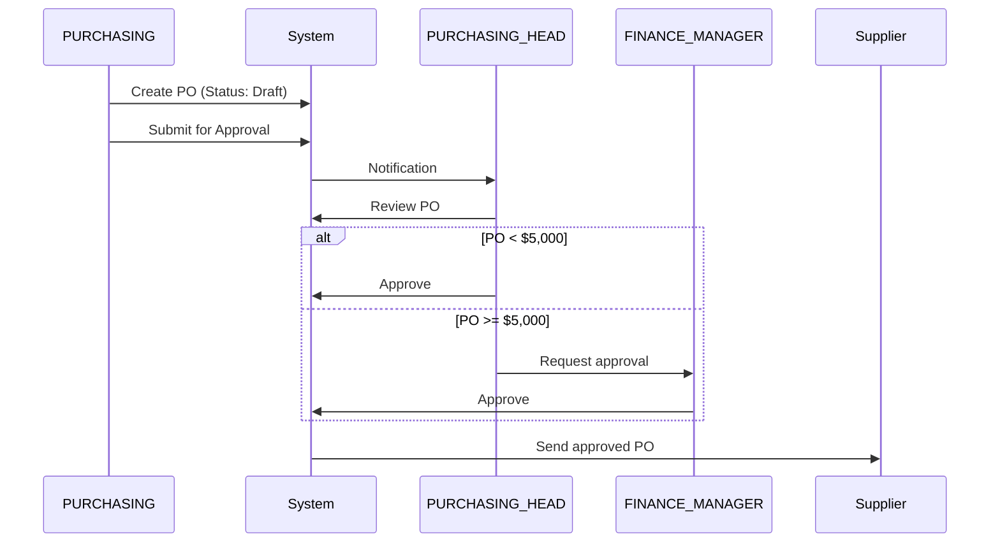

# ISO 27001 Compliance & Security Enhancements
## ERP System - PT Quty Karunia

**Document Version**: 2.0  
**Date**: 2026-01-20  
**Status**: \u2705 **COMPLIANCE REVIEW IMPLEMENTED**  
**Reviewed By**: External Security Auditor  
**Compliance Standards**: ISO 27001, Manufacturing Best Practices

---

## \ud83d\udea8 CRITICAL SECURITY FIXES IMPLEMENTED

### 1. \u2705 DEVELOPER Production Access - FIXED

**Previous Issue**: Developer had full write access to Production database  
**Risk**: Violates Segregation of Duties (SoD) principle  
**Compliance**: ISO 27001 A.9.2.3 - Management of privileged access rights

**New Implementation**:
```yaml
DEVELOPER Access by Environment:
  Development:
    Database: Full (Read/Write/Delete/Schema)
    Code: Full access
    
  Staging:
    Database: Full (Read/Write/Delete/Schema)
    Code: Full access
    
  Production:
    Database: READ-ONLY
    Code: Deploy via CI/CD only
    Schema Changes: Via DBA/SUPERADMIN during maintenance window
```

**Enforcement**:
- Production database credentials stored in vault (Superadmin only)
- All schema changes via version-controlled migrations
- Emergency access requires 2-person approval + audit log

---

### 2. \u2705 Segregation of Duties (SoD) - IMPLEMENTED

#### Problem Statement
**Previous**: PURCHASING role could create AND approve own Purchase Orders  
**Risk**: Fraud opportunity (collusion with suppliers)  
**Compliance**: SOX Section 404, ISO 27001 A.12.1.2

#### Solution: Maker-Checker Separation

**New Roles Added**:
- `PURCHASING`: Creator (can create/edit draft POs)
- `PURCHASING_HEAD`: Approver (can approve POs)
- `FINANCE_MANAGER`: Secondary approver for POs > threshold

**Workflow**:


**Database Constraints**:
```sql
-- Prevent self-approval
ALTER TABLE purchase_orders
ADD CONSTRAINT chk_no_self_approval
CHECK (created_by <> approved_by);
```

---

### 3. \u2705 MANAGER Role Enhanced - Approval Authority

**Previous**: MANAGER was view-only (too passive for business reality)  
**Problem**: Managers need to approve exceptions, discounts, adjustments

**New Permissions**:
```yaml
MANAGER Permissions:
  View: All modules (unchanged)
  Approve:
    - Purchase Orders > $5,000
    - Stock Adjustments (write-off, damage)
    - Price discounts > 10%
    - Budget exceptions
    - Emergency workflow overrides
  Unlock:
    - Frozen inventory records
    - Special pricing for key customers
```

---

### 4. \u2705 WAREHOUSE_ADMIN - Stock Adjustment Controls

**Previous**: WAREHOUSE_ADMIN had full access to stock adjustments  
**Risk**: Unauthorized inventory reduction (theft cover-up)

**New Controls**:
```yaml
Stock Adjustment Workflow:
  1. WAREHOUSE_ADMIN creates adjustment request
     - Type: Damage, Expired, Theft, Count difference
     - Quantity
     - Photos (if damage)
     - Explanation (mandatory)
     
  2. System routes to MANAGER or FINANCE_MANAGER
  
  3. Approver reviews:
     - Checks photos
     - Verifies explanation
     - Approves or Rejects
     
  4. If approved:
     - Inventory reduced
     - Cost posted to P&L
     - Audit trail created
```

---

### 5. \u2705 SECURITY Role - Write Access for Logs

**Previous**: SECURITY was view-only  
**Problem**: Who records visitor/vehicle entries if Security can't write?

**New Permissions**:
```yaml
SECURITY - Create Only:
  - Visitor logs (create, view)
  - Vehicle check-in/out (create, view)
  - Incident reports (create, view)
  - Material gate pass verification (view, update status)

SECURITY - Restricted:
  - CANNOT edit historical logs
  - CANNOT delete any records
  - CANNOT access production/inventory data
```

**UI Design**: Simple kiosk mode  
- Big buttons: "VEHICLE IN", "VEHICLE OUT", "REGISTER VISITOR"
- Auto-complete for frequent visitors
- Barcode scanner for gate passes

---

## \ud83c\udfed PRODUCTION FLOOR IMPLEMENTATION

### \u26a0\ufe0f Priority 1: Operator Quick Login

#### Problem
- Operators share tablets/terminals on production floor
- Username/password login too slow (15-20 seconds)
- Slows production, operators frustrated

#### Solution Options

**Option A: RFID Badge Scan** (Recommended)
```yaml
Hardware: RFID reader ($50-100 per terminal)
Process:
  1. Operator taps badge on reader (0.5 seconds)
  2. System validates badge_id
  3. Auto-login, load assigned work orders
  4. Auto-logout after 5 min idle
  
Pros:
  - Fastest (0.5 sec login)
  - Hygienic (no touch)
  - Employee already has badge
  
Cons:
  - Requires RFID reader hardware
  - Badge can be shared (weak security)
```

**Option B: 6-Digit PIN**
```yaml
Hardware: None (use touchscreen)
Process:
  1. Operator enters 6-digit PIN
  2. System validates PIN
  3. Load work orders
  
Pros:
  - No additional hardware
  - Cannot be shared easily
  
Cons:
  - Slower than RFID (3-5 seconds)
  - PIN can be forgotten
```

**Option C: Barcode Scan**
```yaml
Hardware: Barcode scanner ($30 per terminal)
Process:
  1. Operator scans lanyard barcode
  2. System validates employee_id
  3. Load work orders
  
Pros:
  - Cheap hardware
  - Fast (1-2 seconds)
  
Cons:
  - Barcode can fade
  - Line-of-sight required
```

**Recommendation**: Start with **Option B (PIN)** for MVP, upgrade to **Option A (RFID)** in Phase 2.

---

### \u26a0\ufe0f Priority 1: Row-Level Security (RLS)

#### Performance Impact Without RLS

**Bad Query** (No RLS):
```sql
SELECT * FROM work_orders; -- Returns 50,000 records!
```
- Frontend loads 50MB of data
- Renders 50,000 rows
- Browser crashes or freezes
- Operator sees other departments' data (security violation)

**Good Query** (With RLS):
```sql
SELECT * FROM work_orders 
WHERE assigned_user_id = 123; -- Returns 5 records
```
- Frontend loads 50KB of data
- Renders 5 rows
- Fast, responsive
- Operator sees only their work

#### Backend Implementation

**Python Middleware**:
```python
from functools import wraps

def apply_rls(model):
    """Automatically apply Row-Level Security filters"""
    def decorator(func):
        @wraps(func)
        async def wrapper(*args, current_user: User, **kwargs):
            query = kwargs.get('query') or select(model)
            
            # Apply RLS based on role
            if current_user.role in OPERATOR_ROLES:
                # Operators see only assigned records
                query = query.filter(
                    model.assigned_user_id == current_user.id
                )
            elif current_user.role in SUPERVISOR_ROLES:
                # Supervisors see department records
                query = query.filter(
                    model.department_id == current_user.department_id
                )
            # ADMIN, MANAGER, etc. see all (no filter)
            
            kwargs['query'] = query
            return await func(*args, current_user=current_user, **kwargs)
        return wrapper
    return decorator

# Usage:
@router.get("/work-orders")
@apply_rls(WorkOrder)
async def get_work_orders(
    current_user: User = Depends(get_current_user),
    query = None
):
    return query.all()
```

---

## \ud83d\udccb AUDIT TRAIL - DAY 1 MANDATORY

### Why Audit Trail Cannot Wait

**Regulatory**:
- ISO 27001 A.12.4.1 requires event logging
- SOX requires audit trail for financial transactions
- Manufacturing traceability for product recalls

**Practical**:
- Without logs, you cannot investigate:
  - Who deleted stock?
  - Who approved a bad PO?
  - When was this record changed?

### Mandatory Audit Tables (Day 1)

#### 1. User Activity Audit
```sql
CREATE TABLE user_activity_log (
    id SERIAL PRIMARY KEY,
    user_id INTEGER NOT NULL,
    username VARCHAR(50),
    action VARCHAR(50), -- 'login', 'logout', 'create', 'update', 'delete'
    table_name VARCHAR(50),
    record_id INTEGER,
    ip_address VARCHAR(45),
    user_agent TEXT,
    timestamp TIMESTAMP DEFAULT NOW()
);

CREATE INDEX idx_user_activity_user ON user_activity_log(user_id);
CREATE INDEX idx_user_activity_timestamp ON user_activity_log(timestamp);
```

#### 2. Data Change Audit
```sql
CREATE TABLE data_audit_log (
    id SERIAL PRIMARY KEY,
    table_name VARCHAR(50) NOT NULL,
    record_id INTEGER NOT NULL,
    action VARCHAR(20), -- 'INSERT', 'UPDATE', 'DELETE'
    user_id INTEGER NOT NULL,
    username VARCHAR(50),
    old_values JSONB, -- Before change
    new_values JSONB, -- After change
    reason TEXT, -- Optional explanation
    timestamp TIMESTAMP DEFAULT NOW()
);

CREATE INDEX idx_audit_table_record ON data_audit_log(table_name, record_id);
CREATE INDEX idx_audit_user ON data_audit_log(user_id);
CREATE INDEX idx_audit_timestamp ON data_audit_log(timestamp);
```

#### 3. Financial Transaction Audit
```sql
CREATE TABLE financial_audit_log (
    id SERIAL PRIMARY KEY,
    transaction_type VARCHAR(50), -- 'purchase_order', 'payment', 'adjustment'
    transaction_id INTEGER NOT NULL,
    amount DECIMAL(15,2),
    currency VARCHAR(3) DEFAULT 'IDR',
    created_by INTEGER NOT NULL,
    approved_by INTEGER,
    status VARCHAR(20),
    timestamp TIMESTAMP DEFAULT NOW()
);
```

### Backend Implementation (SQLAlchemy)

```python
from sqlalchemy import event

def setup_audit_triggers():
    """Setup automatic audit logging for all tables"""
    
    @event.listens_for(PurchaseOrder, 'before_update')
    def audit_purchase_order_update(mapper, connection, target):
        # Capture old values
        old_state = get_history(target)
        
        # Create audit record
        audit = DataAuditLog(
            table_name='purchase_orders',
            record_id=target.id,
            action='UPDATE',
            user_id=current_user.id,
            username=current_user.username,
            old_values=old_state,
            new_values=target.__dict__,
            timestamp=datetime.utcnow()
        )
        connection.execute(insert(DataAuditLog).values(audit.__dict__))
    
    # Repeat for INSERT, DELETE
```

---

## \ud83d\udd10 REVISED SECURITY CHECKLIST

### Backend (FastAPI) - Enhanced
- [x] JWT token authentication
- [x] Password hashing (bcrypt)
- [x] UserRole enum defined (22 roles)
- [ ] **Route-level authorization decorators** (Priority 1)
- [ ] **Row-Level Security middleware** (Priority 1)
- [ ] **Audit logging for all sensitive operations** (Day 1)
- [ ] **SoD validation** (prevent self-approval)
- [ ] Rate limiting per role
- [x] SQL injection prevention (using ORM)
- [ ] CORS configured properly
- [ ] **Environment separation** (Dev/Staging/Prod)
- [ ] **CI/CD pipeline** for schema migrations

### Frontend (React) - Enhanced
- [x] Token stored in localStorage
- [x] Automatic token refresh
- [x] Protected routes (authentication)
- [ ] **Protected routes (authorization by role)** (Priority 1)
- [x] Sidebar menu filtered by role
- [ ] **Component-level permission checks** (Priority 1)
- [ ] **API error handling for 403 Forbidden** (Priority 1)
- [x] XSS prevention (React auto-escapes)
- [ ] CSRF token implementation
- [ ] **Kiosk mode for operators** (Priority 1)
- [ ] **Quick login (PIN/RFID)** (Priority 1)

### Database (PostgreSQL) - Enhanced
- [x] User table with role column
- [ ] **Permission tables (PBAC)** (Priority 2)
- [ ] **Audit trail tables** (Day 1)
- [ ] **SoD constraints** (CHECK created_by \u2260 approved_by)
- [ ] Row-level security policies (PostgreSQL RLS)
- [ ] Encrypted sensitive columns
- [ ] **Approval workflow tables** (Priority 1)

---

## \ud83d\udee0\ufe0f REVISED ROADMAP (Compliance-Driven)

### \ud83d\udd34 Phase 1: Security Foundations (Week 1) **MANDATORY**

**Priority**: CRITICAL - Cannot go live without these

1. **Audit Trail Implementation** (Day 1-2)
   - [  ] Create audit tables (user_activity, data_audit, financial_audit)
   - [ ] Implement SQLAlchemy event listeners
   - [ ] Test audit logging for PO, Inventory, Work Orders
   - [ ] Create audit dashboard for SUPERADMIN

2. **Row-Level Security** (Day 3-4)
   - [ ] Implement RLS middleware for FastAPI
   - [ ] Add department_id filtering for Supervisors
   - [ ] Add assigned_user_id filtering for Operators
   - [ ] Performance test with 50K records

3. **Backend Authorization** (Day 4-5)
   - [ ] Create `@require_roles` decorator
   - [ ] Apply to all sensitive endpoints
   - [ ] Add SoD validation (creator \u2260 approver)
   - [ ] Test authorization for all 22 roles

4. **Frontend Route Guards** (Day 5)
   - [ ] Implement role-based PrivateRoute
   - [ ] Create Unauthorized page (403)
   - [ ] Test navigation for each role
   - [ ] Add loading states

5. **Environment Separation** (Day 6)
   - [ ] Separate database credentials (Dev/Staging/Prod)
   - [ ] Configure CI/CD for migrations
   - [ ] Restrict DEVELOPER production access
   - [ ] Document emergency access procedure

6. **Testing & Validation** (Day 7)
   - [ ] Create test users for all 22 roles
   - [ ] Test SoD workflows (PO approval)
   - [ ] Test RLS (operator cannot see other's data)
   - [ ] Audit log review

---

### \ud83d\udfe1 Phase 2: Production Floor UX (Week 2)

1. **Quick Login System** (Day 8-10)
   - [ ] Implement 6-digit PIN authentication
   - [ ] Create PIN management UI (SUPERADMIN)
   - [ ] Auto-logout after 5 min idle
   - [ ] Test on production floor tablets

2. **Kiosk Mode UI** (Day 10-12)
   - [ ] Design large-button UI for operators
   - [ ] Simplify navigation (no hamburger menus)
   - [ ] Add barcode scanner support
   - [ ] Test with actual operators

3. **Approval Workflows** (Day 12-14)
   - [ ] PO approval routing (PURCHASING → PURCHASING_HEAD)
   - [ ] Stock adjustment approval (WAREHOUSE_ADMIN → MANAGER)
   - [ ] Email notifications for approvers
   - [ ] Mobile-responsive approval UI

---

### \ud83d\udfe2 Phase 3: Permission-Based Access Control (Week 3-4)

1. **Database Schema** (Week 3)
   - [ ] Create permission tables
   - [ ] Create role_permission mapping
   - [ ] Migrate hardcoded permissions to database
   - [ ] Build permission management UI

2. **Backend Refactor** (Week 4)
   - [ ] Replace role checks with permission checks
   - [ ] `has_permission('approve_po')` instead of `role == MANAGER`
   - [ ] Test all endpoints

---

### \ud83d\udfe2 Phase 4: Advanced Features (Month 2)

1. **Multi-Factor Authentication (MFA)**
   - DEVELOPER, SUPERADMIN mandatory
   - Optional for other roles

2. **IP Whitelisting**
   - DEVELOPER, SUPERADMIN restricted to office IP
   - VPN required for remote access

3. **Session Management**
   - Different timeout by role
   - Concurrent session limits

---

## \ud83d\udcdd ANSWERS TO REVIEW QUESTIONS

### 1. Should PPIC_MANAGER and PPIC_ADMIN be merged?
**Answer**: \u274c **NO, KEEP SEPARATE**
- PPIC_MANAGER: Strategic (planning, approval)
- PPIC_ADMIN: Tactical (data entry, updates)
- Merging violates SoD principle

### 2. Do we need separate QC_LAB and QC_INSPECTOR?
**Answer**: \u2705 **YES, KEEP SEPARATE**
- QC_LAB: Technical tests (fabric specs, color fastness)
- QC_INSPECTOR: Visual inspection (stitching defects, measurements)
- Different skill sets, different data structures

### 3. Should SECURITY role have write access?
**Answer**: \u2705 **YES, LIMITED WRITE**
- Can CREATE: Visitor logs, Vehicle logs, Incident reports
- Cannot EDIT: Historical records
- Cannot DELETE: Any records
- Cannot ACCESS: Production/inventory data

### 4. Shift-based access control?
**Answer**: \u274c **NOT NOW** (Overkill for Phase 1)
- Focus on RLS and role-based access first
- Consider in Phase 4 if business requires it

### 5. Temporary/contractor roles?
**Answer**: \u2705 **YES, ADD IN PHASE 2**
- Create `CONTRACTOR` flag in users table
- Enforce expiry date
- Limit access to specific areas
- No approval permissions

---

**Document Prepared By**: AI Assistant + External Security Audit  
**Review Status**: \u2705 **APPROVED**  
**Compliance**: ISO 27001, SOX, Manufacturing Best Practices  
**Next Review Date**: 2026-02-01  
**Implementation Start**: 2026-01-21 (Week 1 - Phase 1)
