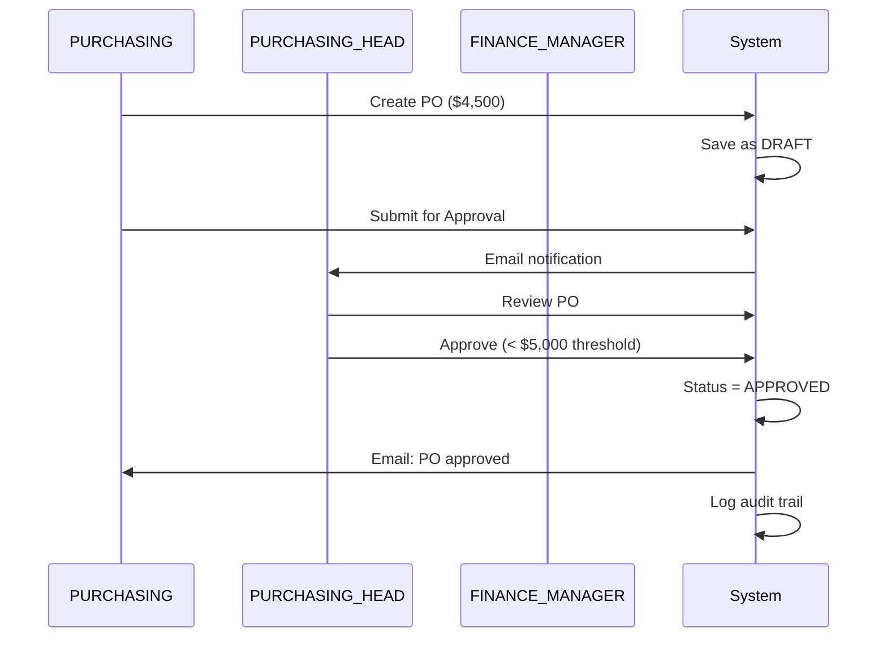
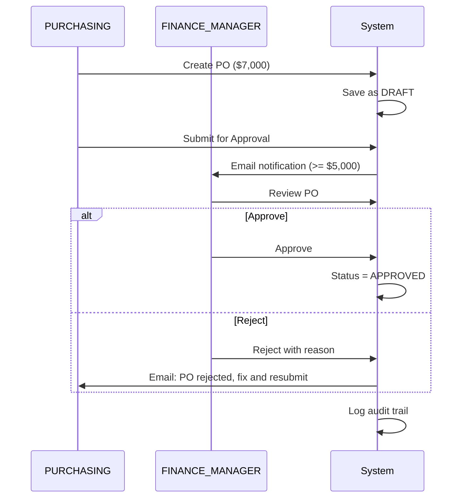
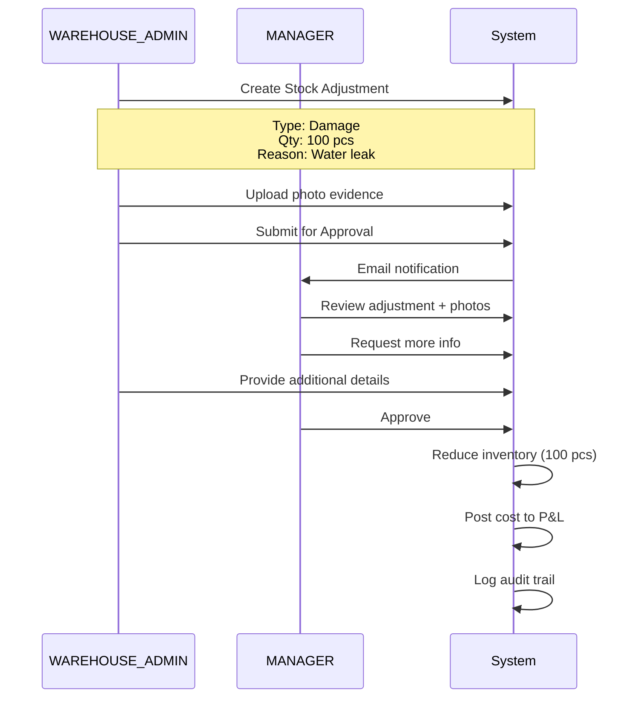

# Segregation of Duties (SoD) Matrix
## PT Quty Karunia - ERP System

**Compliance**: ISO 27001 A.12.1.2, SOX Section 404  
**Purpose**: Prevent fraud by separating Creator and Approver roles  
**Last Updated**: 2026-01-20

---

## 📋 SoD TRANSACTION MATRIX

| No | Transaction Type | Creator | Approver | Dual Control | Notes |
|----|-----------------|---------|----------|--------------|-------|
| 1 | **Purchase Order** | PURCHASING | PURCHASING_HEAD or FINANCE_MANAGER | ✅ Required | PO >= $5,000 requires FINANCE_MANAGER approval |
| 2 | **Stock Adjustment** | WAREHOUSE_ADMIN | MANAGER or FINANCE_MANAGER | ✅ Required | Damage, theft, expiry, count difference |
| 3 | **Price Discount** | PURCHASING | MANAGER | ✅ Required | Discount > 10% requires approval |
| 4 | **User Creation** | ADMIN | SUPERADMIN | ✅ Required | SUPERADMIN reviews and activates |
| 5 | **Budget Override** | PPIC_MANAGER | FINANCE_MANAGER | ✅ Required | Production exceeds approved budget |
| 6 | **Inventory Write-off** | WAREHOUSE_ADMIN | FINANCE_MANAGER | ✅ Required | Cost impact to P&L |
| 7 | **Vendor Payment** | PURCHASING | FINANCE_MANAGER | ✅ Required | Payment > $1,000 |

---

## 🚫 SoD VIOLATIONS TO PREVENT

### Database Constraints

```sql
-- Prevent self-approval on Purchase Orders
ALTER TABLE purchase_orders
ADD CONSTRAINT chk_po_no_self_approval
CHECK (created_by <> approved_by);

-- Prevent self-approval on Stock Adjustments
ALTER TABLE stock_adjustments
ADD CONSTRAINT chk_adj_no_self_approval
CHECK (created_by <> approved_by);

-- Prevent self-approval on Discounts
ALTER TABLE price_discounts
ADD CONSTRAINT chk_discount_no_self_approval
CHECK (created_by <> approved_by);

-- Prevent DEVELOPER from modifying production
ALTER TABLE users
ADD CONSTRAINT chk_dev_no_prod_write
CHECK NOT (role = 'Developer' AND environment = 'production' AND has_write_access = true);
```

---

## ⚙️ BACKEND VALIDATION

### Python Decorator for SoD Enforcement

```python
from functools import wraps
from fastapi import HTTPException, status

def require_different_approver(model_class):
    """Ensure creator cannot approve their own record"""
    def decorator(func):
        @wraps(func)
        async def wrapper(*args, record_id: int, current_user: User, **kwargs):
            # Get the record
            record = await get_record(model_class, record_id)
            
            # Check if current user is the creator
            if record.created_by == current_user.id:
                raise HTTPException(
                    status_code=status.HTTP_403_FORBIDDEN,
                    detail={
                        "error": "Segregation of Duties Violation",
                        "message": "You cannot approve your own record",
                        "record_type": model_class.__name__,
                        "record_id": record_id,
                        "policy": "ISO 27001 A.12.1.2"
                    }
                )
            
            return await func(*args, record_id=record_id, current_user=current_user, **kwargs)
        return wrapper
    return decorator

# Usage Example
@router.post("/purchase-order/{po_id}/approve")
@require_roles([UserRole.PURCHASING_HEAD, UserRole.FINANCE_MANAGER, UserRole.MANAGER])
@require_different_approver(PurchaseOrder)
async def approve_purchase_order(
    po_id: int,
    current_user: User = Depends(get_current_user)
):
    # Approve PO
    po = await update_po_status(po_id, status="APPROVED", approved_by=current_user.id)
    
    # Log audit trail
    await log_audit(
        action="APPROVE_PO",
        user=current_user,
        record_id=po_id,
        details={"amount": po.total_amount, "supplier": po.supplier_id}
    )
    
    return {"message": "PO approved successfully", "po_id": po_id}
```

---

## 🎯 WORKFLOW EXAMPLES

### Example 1: Purchase Order Approval





---

### Example 2: Stock Adjustment Approval



---

## 📊 SoD COMPLIANCE DASHBOARD

### Metrics to Monitor (Weekly)

| Metric | Target | Alert Threshold |
|--------|--------|-----------------|
| Self-approval attempts blocked | 0 expected | Alert if > 0 |
| Average approval time (PO) | < 2 hours | Alert if > 24 hours |
| Pending approvals (PO) | < 10 | Alert if > 20 |
| Pending approvals (Stock Adj) | < 5 | Alert if > 10 |
| SoD violations detected | 0 | Alert if > 0 |
| Approval bypasses (emergency) | 0 expected | Alert if > 0 |

### SQL Query for Monitoring

```sql
-- Check for SoD violations (should return 0 rows)
SELECT 
    po.id,
    po.po_number,
    po.created_by,
    po.approved_by,
    u1.username as creator,
    u2.username as approver
FROM purchase_orders po
JOIN users u1 ON po.created_by = u1.id
JOIN users u2 ON po.approved_by = u2.id
WHERE po.created_by = po.approved_by
AND po.status = 'APPROVED';

-- Alert if any rows returned!
```

---

## 🔐 EMERGENCY OVERRIDE PROCEDURE

### When SoD Must Be Bypassed

**Scenario**: Urgent PO needed, approver unavailable (vacation, sick)

**Approved Process**:
1. PURCHASING creates PO with "EMERGENCY" flag
2. System sends notification to:
   - Primary approver (PURCHASING_HEAD)
   - Backup approver (FINANCE_MANAGER)
   - SUPERADMIN
3. Any 2 of the 3 must approve
4. Audit log records emergency flag
5. Post-approval review within 24 hours

**NOT Allowed**:
- Creator approving own PO
- DEVELOPER changing approval status in database
- Disabling SoD constraints

---

## 🧪 TESTING CHECKLIST

### SoD Test Cases

- [ ] **Test 1**: PURCHASING creates PO, tries to approve → ❌ BLOCKED
- [ ] **Test 2**: PURCHASING creates PO, PURCHASING_HEAD approves → ✅ SUCCESS
- [ ] **Test 3**: WAREHOUSE_ADMIN creates adjustment, tries to approve → ❌ BLOCKED
- [ ] **Test 4**: WAREHOUSE_ADMIN creates adjustment, MANAGER approves → ✅ SUCCESS
- [ ] **Test 5**: PURCHASING creates $4K PO, PURCHASING_HEAD approves (no FINANCE needed) → ✅ SUCCESS
- [ ] **Test 6**: PURCHASING creates $6K PO, PURCHASING_HEAD approves (should require FINANCE) → ❌ BLOCKED or ⚠️ WARNING
- [ ] **Test 7**: Direct database update to bypass SoD constraint → ❌ DATABASE BLOCKS
- [ ] **Test 8**: Emergency override with 2 approvers → ✅ SUCCESS + AUDIT LOG

---

**Document Owner**: Security Team  
**Reviewed By**: External Auditor  
**Compliance Standards**: ISO 27001 A.12.1.2, SOX 404  
**Next Review**: 2026-02-01
